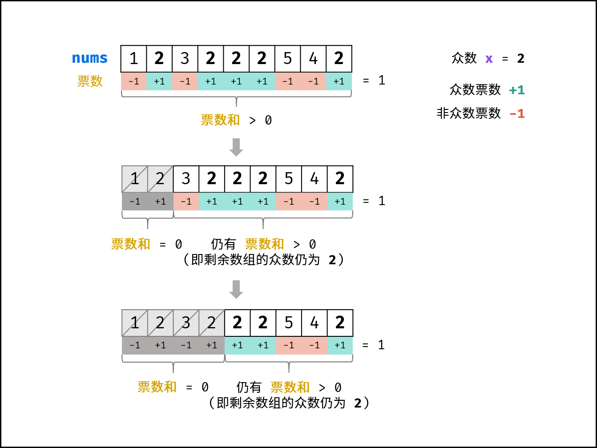

#

## 多数元素题解

### 多数元素

  给定一个大小为 n 的数组 nums ，返回其中的多数元素。多数元素是指在数组中出现次数 大于【n/2】 的元素。

#### 摩尔投票法

  核心理念为票数正负抵消，此方法时间和空间复杂度分别为O(N) 和 O(1)
  摩尔投票：
  设输入数组 nums 的众数为 x ，数组长度为 n 。
  推论一： 若记众数的票数为 +1 ，非众数的票数为 -1 ，则一定有所有数字的票数和 >0 。
  推论二： 若数组的前 a 个数字的票数和 =0 ，则数组剩余 (n-a) 个数字的票数和一定仍 >0 ，即后 (n-a) 个数字的众数仍为x 。
  

#### 算法流程

##### 1. 初始化：票数统计 votes = 0 ， 众数 x

##### 2. 循环：遍历数组 nums 中的每个数字 num

##### a. 当 票数 votes 等于 0 ，则假设当前数字 num 是众数

##### b. 当 num = x 时，票数 votes 自增 1 ；当 num != x 时，票数 votes 自减 1

##### 3. 返回值： 返回 x 即可

    class Solution {
    public:
    int majorityElement(vector<int>& nums) {
        int x = 0, votes = 0;
        for (int num : nums){
            if (votes == 0) x = num;
            votes += num == x ? 1 : -1;
        }
        return x;
    }
    };
