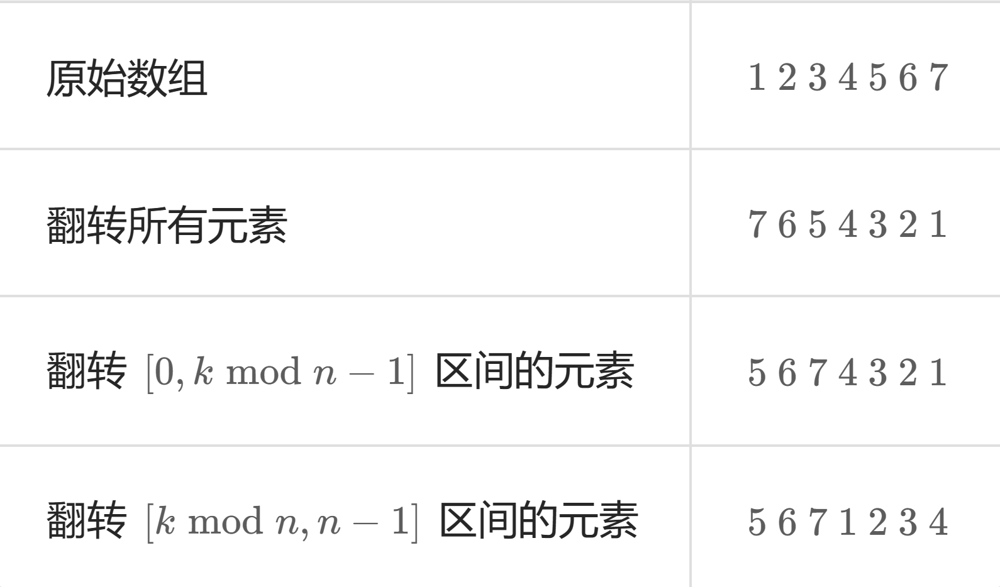

# 轮转数组

给定一个整数数组 $nums$，将数组中的元素向右轮转$k$ 个位置，其中$ k$ 是非负数。

## 方法三：数组翻转

该方法基于如下的事实：当我们将数组的元素向右移动 $k$次后，尾部$ k modn $个元素会移动至数组头部，其余元素向后移动 $kmodn$个位置。

该方法为数组的翻转：我们可以先将所有元素翻转，这样尾部的 $kmodn$ 个元素就被移至数组头部，然后我们再翻转$[0,kmodn]$区间的元素和 $[kmodn,n]$区间的元素即能得到最后的答案。

    class Solution {
    public:
    void reverse(vector<int>& nums, int start, int end) {
        while (start < end) {
            swap(nums[start], nums[end]);
            start += 1;
            end -= 1;
        }
    }

    void rotate(vector<int>& nums, int k) {
        k %= nums.size();
        reverse(nums, 0, nums.size() - 1);
        reverse(nums, 0, k - 1);
        reverse(nums, k, nums.size() - 1);
    }
    };

